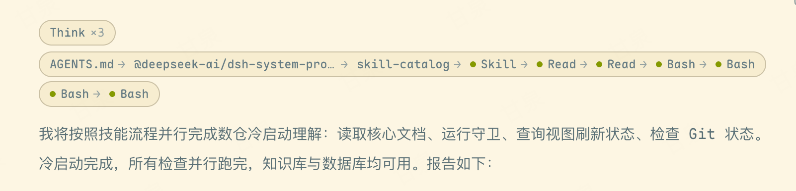

# dsh-ux

[中文](README.md) | **English**

A UI enhancement suite for DeepSeek Harness (DSH) Web, consisting of two parts:

| Component | Description |
|-----------|-------------|
| **dsh-enhance** (repository root) | DSH Web plugin for theming, layout, collapsible capsules, and usage information |
| **dsh-desktop** (`desktop/`) | Frameless Electron desktop shell with one-click startup |


## Features (dsh-enhance)

| Category | Description |
|----------|-------------|
| Theme | Solarized light palette (the official dark theme is preserved) and a Maple Mono font stack that is enabled only when the font is available |
| Layout | Wider message column, tighter spacing, a compact composer dock, and disabled rubber-band scrolling |
| Collapsible capsules | Aggregates reasoning blocks into a `Think ×N` capsule and tool calls into an `A → B → C` chain; long chains wrap according to the available width, with each visual line rendered as its own capsule |
| Usage information | Shows the official account balance, estimated cost for the current session, and a local 30-day usage chart in the footer |

Long tool chains automatically reflow with the message column while preserving a complete, independent capsule around each visual line:



## Installation

Prerequisite: DSH is already running through its profile mechanism (`dsh web`).

```bash
dsh plugin --profile web add github:jiangnanquan/dsh-ux#main
```

The package declares both `dsh.bundle.patch` and `dsh.client`. `dsh plugin add` automatically adds the plugin to the profile bundle list. **Restart DSH to activate it**; no manual configuration edits are required. Running the installation command again is safe and idempotent. To update, run `dsh plugin --profile web update dsh-enhance`.

## Hand It to Your AI Agent

If you prefer not to run the commands manually, paste the following prompt into any AI coding agent (Claude Code, DSH, Gemini CLI, and others) and ask it to follow `INSTALL.md`:

> Follow the instructions in https://github.com/jiangnanquan/dsh-ux/blob/main/INSTALL.md to install and verify the dsh-enhance plugin on my machine using the web profile. Run the documented health checks and report the results. If any step fails, follow the rollback instructions and explain the cause.

## Desktop Shell (dsh-desktop)

The macOS frameless desktop shell presents DSH Web as a desktop application. Double-click `启动 DSH.command` to start the backend and open the window; on exit, it stops only the backend process that it started. The shell supports the `DSH_URL` and `DSH_SNAPSHOT` environment variables.

See [desktop/README.md](desktop/README.md) for details (Chinese).

## Requirements and Notes (dsh-enhance)

- **Font:** Maple Mono is preferred. If it is not installed, the plugin falls back to PingFang SC, SF Mono, Menlo, or another monospace font. Install [Maple Mono](https://github.com/subframe7536/maple-font) for the intended appearance.
- **Balance, current-session cost, and usage chart:** These features call the official DeepSeek API and require `DEEPSEEK_API_KEY` to be configured in DSH. If credentials are unavailable, the fields show an unavailable or failed state without affecting the other features.
- The pricing table is hard-coded in `pricingFor` inside `lib/index.js` using official peak and off-peak rates (peak hours in Beijing time: 09:00–12:00 and 14:00–18:00; half price at other times). Update it if DeepSeek changes its pricing.

## Uninstallation

```bash
dsh plugin --profile web remove dsh-enhance
```

## License

MIT
